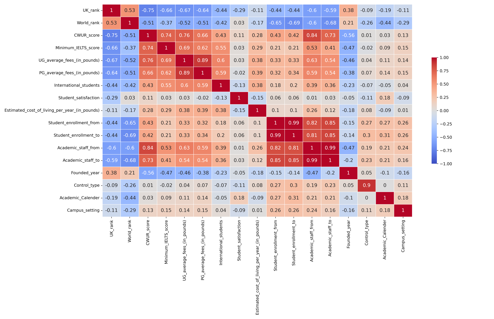

# Understanding the Universities Dataset
The following sections provide an extensive analysis of the Universities dataset and pre-processing steps carried out to improve prediction of our models.

1. Who and how created the data set?
      - Author is Koli Mayuresh, data set is available at [Kaggle](https://www.kaggle.com/datasets/mayureshkoli/best-universities-in-the-united-kingdom).
      The data was generated by a web scrappers.
2. Give an overview about the data.
      - The dataset includes 21 variables. 147 values are missing in total.
      - A Tableau Visualization can be found [here](https://public.tableau.com/app/profile/mayuresh.koli/viz/TheBestUniversitiesintheUnitedKingdom/Dashboard1).
3. Is the data biased?
      - Since the the data set only contains universities of the United Kingdom it is biased by it's culture, law and regulations.
4. Which information is missing?
      - 6 out of 22 columns have missing values and the columns, where values miss the most often are `CWUR_score`, `Academic_Calender` and `Campus_setting`.

      |  #  | Column                                         | Non-Null Count  | Null Count | Data Type| Variable Type
      |-----|------------------------------------------------|-----------------|------------|----------|---------------|
      |  0  | Id                                             | 145 non-null    |   0        | int64    | continuous    |
      |  1  | University_name                                | 131 non-null    |  14        | object   | categorical   |
      |  2  | Region                                         | 145 non-null    |   0        | object   | categorical   |
      |  3  | Founded_year                                   | 130 non-null    |  15        | float64  | continuous    |
      |  4  | Motto                                          | 127 non-null    |  18        | object   | categorical   |
      |  5  | UK_rank                                        | 145 non-null    |   0        | int64    | continuous    |
      |  6  | World_rank                                     | 145 non-null    |   0        | int64    | continuous    |
      |  7  | CWUR_score                                     |  93 non-null    |  52        | float64  | continuous    |
      |  8  | Minimum_IELTS_score                            | 145 non-null    |   0        | float64  | continuous    |
      |  9  | UG_average_fees_(in_pounds)                    | 145 non-null    |   0        | int64    | continuous    |
      |  10 | PG_average_fees_(in_pounds)                    | 145 non-null    |   0        | int64    | continuous    |
      |  11 | International_students                         | 145 non-null    |   0        | object   | categorical   |
      |  12 | Student_satisfaction                           | 145 non-null    |   0        | object   | categorical   |
      |  13 | Student_enrollment                             | 145 non-null    |   0        | object   | categorical   |
      |  14 | Academic_staff                                 | 145 non-null    |   0        | object   | categorical   |
      |  15 | Control_type                                   | 145 non-null    |   0        | object   | categorical   |
      |  16 | Academic_Calender                              | 116 non-null    |  29        | object   | categorical   |
      |  17 | Campus_setting                                 | 126 non-null    |  19        | object   | categorical   |
      |  18 | Estimated_cost_of_living_per_year_(in_pounds)  | 145 non-null    |   0        | int64    | continuous    |
      |  19 | Latitude                                       | 145 non-null    |   0        | float64  | continuous    |
      |  20 | Longitude                                      | 145 non-null    |   0        | float64  | continuous    |
      |  21 | Website                                        | 145 non-null    |   0        | object   | categorical   |

      - In comparison 91 entries miss at least 1 value while 54 entires are compleat. The maximum number of missing values in an entry is 4.

      | number of missing values per row:  |  0 |   1 |  2 |  3 | 4 |
      |------------------------------------|----|-----|----|----|---|
      | count:                             | 54 |  51 | 27 | 10 | 3 |

5. Are there any similar data set, e.g. for US universities?
      - There is a similar dataset from 2019 featuring American universities: [american-university-rankings-top-150](https://www.kaggle.com/datasets/peterpenner445/american-university-rankings-top-150).
6. How old is the data set?
      - The data set was updated last time 8 months ago. [Times UK overall ranking 2019](https://www.ukuni.net/universities).
      - Newest ranking is available [here](https://www.timeshighereducation.com/student/best-universities/best-universities-uk).
7. How many Universities are there in GB? Are all included in this data set?
      - In 2021-22, there were 285 higher education providers in the UK that returned data to the [Higher Education Statistics Agency (HESA)](https://www.hesa.ac.uk/)
8. How many regions are there in GB?
      - The UK consists of 4 countries (England, Northern Ireland, Scotland, Wales) and for the regions it is split into 12 "regions", 9 regions of England and the 3 remaining countries. (East Midlands, London, North West England, South West England, West Midlands, East of England, North East England, South East England, Yorkshire and the Humber, Northern Ireland, Scotland, Wales)
9. What is *CWUR score*?
       - *CWUR* - Center for World University Rankings Score. See [here](https://cwur.org).
10. What is *Minimum IELTS score*?
       - (IELTS) International English Language Testing System. Universities typically require students to have IELTS scores to gain entry.
11. What *UG* means in *UG average fees*?
       - Under graduate, similar to bachelor's studies.
12. What *PG* means in *PG average fees*?
       - Post graduate, similar to master's studies.

## Correlation Analysis
The following plot captures the correlation of data from continuous and categorical columns:

TODO: comment on the dependencies relationships

## Knowledge gain from the data set

These insights are partial generated with the open-source tool 'orange' and partial by python libraries.

1. Fees behave similar, with the Average PG fees being higher than Average UG fees.
      

2. Most universities are from the capital London. This indicate a data bias.
      

3. The best 3 universities based on CWUR-score are:
      | name                         |  UK rank |  world rank  |  CWUR-Score  |
      |------------------------------|----------|--------------|--------------|
      | University of Cambridge      |  1       |        4     |       94     |
      | University of Oxford         |  2       |        2     |       93.3   |
      | University College London    |  9       |       14     |       88     |

4. Fees tend to rise with CWUR-score.
      

5. UK rank and World rank are similar providing an order where lower values are better, with the best university at rank 1. Private universities tend to be better rated on world rank.
      

6. The CWUR score provide a metric where a higher value is better with the best UK university of a value of 94.
      

7. Most universities are founded in 1925. This could be related to political action.
      

8. The Capital London hold the highest estimated cost of living.
      

9. Suburban Univserities tend to have the highest estimated cost of living.
      

## Pre-processing
We have pre-processed the dataset with the following steps:
1. Cleaning (`src/preprocessing/01_cleaning.py`):
      - setting the first unnamed column as an index,
      - setting values in the column `Founded_year` later than current year to NaN,
      - transforming percentages in columns `International_students` and `Student_satisfaction` interval of [0,1],
      - splitting columns `Student_enrollment` and `Academic_staff` in additional columns with suffixes *from* and *to*,
      - setting value `over` in in the `Academic_staff_from` column to `5000` and value `5000` in the column `Academic_staff_to` to NaN,
      - analyzing the dataset for duplicit entries and filtering them out.

2. Dataset split (`src/preprocessing/02_train_test_split.py`):
      - splitting the dataset immediately to train set (80 %) and test set (20 %) to ensure the will not be any leakage of the test set to the train set.

3. Missing value imputation (`src/preprocessing/03_missing_value_imputation.py`):
      - imputing missing entries in continuos columns `CWUR_score` and `Student_satisfaction` the mean and the median computed for the given column (two versions of the dataset, i.e mean imputed and median imputed, are used from now on),
      - imputing missing entries in categorical columns `Academic_Calender` and `Campus_setting` with the mode, i.e. the most frequent category, for the given column,
      - imputing missing entries in the `Academic_staff_to` column with a constant of 10,000.

4. Normalization and one-hot encoding (`src/preprocessing/04_normalization_one_hot.py`):
      - normalizing continuous columns (`UK_rank`, `World_rank`, `CWUR_score`, `Minimum_IELTS_score`, `International_students`, `Student_satisfaction`, `Estimated_cost_of_living_per_year_(in_pounds)`, `Student_enrollment_from`, `Student_enrollment_to`, `Academic_staff_from`, `Academic_staff_to`) to zero mean and unit variance,
      - one-hot encoding of categorical columns (`Region`, `Control_type`, `Academic_Calender`, `Campus_setting`),
      - sorting column alphabetically by their column names.

5. Numeric values filtering (`src/preprocessing/05_only_numeric_columns.py`)
      - dropping non numeric columns (`Motto`, `University_name`, `Website`),
      - dropping the `Founded_year` column, which still has NaN values,
      - dropping the index `Id` column.
